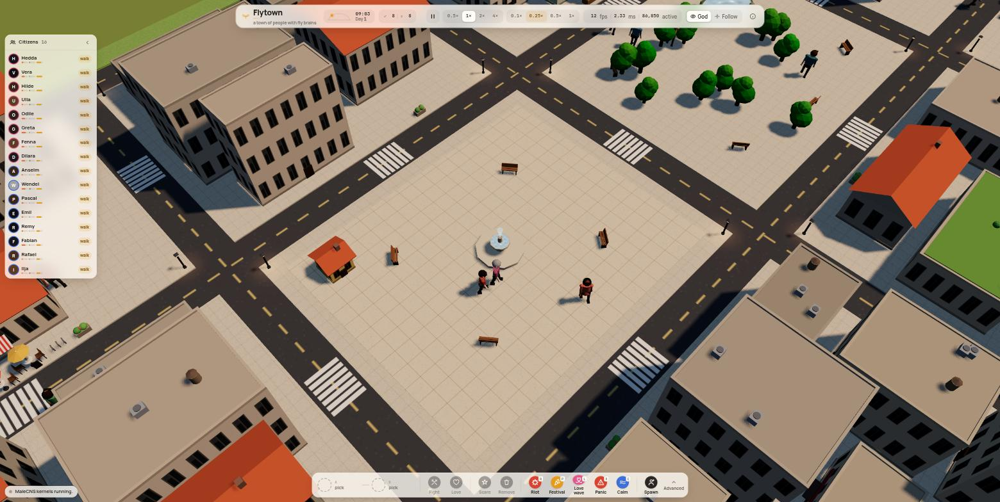

# Flytown

**A town of people with fly brains.**

Every citizen of Flytown is a human-looking character whose behaviour comes out of a real
piece of a fruit fly's nervous system: the **MaleCNS v1.0 connectome** (HHMI Janelia /
Google Research, 2026), pruned to the circuits the game maps and simulated live in your
browser as a spiking network. Nothing is trained. They smell food, notice each other, get
hungry, sing, fight, fall in love and fall asleep because those circuits fire.

**Play it:** https://kapilsareen.github.io/flytown/



## What is real and what is hand-made

| Real (from the data)                                                                                                                                | Hand-made (ours)                                                                                          |
| --------------------------------------------------------------------------------------------------------------------------------------------------- | --------------------------------------------------------------------------------------------------------- |
| The wiring: **8,000 neurons / 234,363 connections / 5.7 M synapses** per citizen, cut from the 163,903-neuron, 6.2 M-connection MaleCNS graph        | Which neurons are "senses" and which are "actions" (chosen from the literature, see `docs/BIOLOGY.md`)     |
| Synapse counts and predicted neurotransmitter signs                                                                                                 | The neuron model: leaky integrate-and-fire with the Shiu et al. 2024 (Nature) parameters, one global weight |
| Reflexes that emerge from the wiring alone: sugar → feeding, looming → escape, a moving figure → steering and courtship, male odour → aggression, antenna touch → grooming | The goal layer that turns brain drives into activities (lunch at a café, a chat, a brawl, going home)    |
|                                                                                                                                                     | Female citizens: the male wiring with male-specific cells silenced                                       |

The About panel in the app says the same, in plain words.

## Controls

| Key / mouse            | Action                                                     |
| ---------------------- | ---------------------------------------------------------- |
| drag / wheel / Q E     | pan, zoom, rotate the god camera                           |
| click / double-click   | select a citizen / follow them in third person             |
| F, `]`, `[`            | follow the most interesting citizen, cycle citizens        |
| Esc                    | back to god view                                           |
| Space, 1–4             | pause, world speed                                         |
| R P L X C              | Riot, Festival, Love wave, Panic, Calm                     |
| `?pop=24&female=0.5`   | URL params: population and female share                    |

Select a citizen to open the inspector: a live spike raster of their 8,000 neurons, activity
per brain region, what they sense, what their descending neurons are pushing for, and a
plain-language "thought" derived from their current goal.

## How it works

```
world (60 Hz)                    brain workers (LIF, 1 ms steps)
  senses.ts   geometry → 14 input channels ──►  Poisson spikes into sensory neurons
                                                 (LC4/LPLC2 looming, ORNs, sugar GRNs, JO, …)
  drives.ts   ◄── 12 output channels ──────────  spike rates of descending / motor groups
              (DNa01/02 steering, DNp09 walk, GF escape, MN9 feed, aDN groom,
               pIP10/vPR6 song, pC1 courtship, aIPg aggression, ER5 sleep, s-LNv clock)
  goals.ts    drives → committed goals with phases (eatOut, court, confront, rest, chat, festival …)
  render3d/   Three.js town, jointed characters animated from goal phases
  ui/         React HUD: roster, inspector, god toolbar, event ticker
```

- `tools/build_brain.py` — prunes the raw MaleCNS tables (1 GB) into `app/public/brain/brain.bin.gz` (0.6 MB): seeds = all mapped channel neurons, 2-hop expansion, strongest partners kept, Kenyon cells sampled.
- `tools/validate_brain.py` — numpy LIF that checks every input→output pathway before the brain ships.
- `app/src/brain/` — the browser kernel (`kernel.ts`), Web Worker pool, loader.
- `docs/ARCHITECTURE.md` — the contract between the parts. `docs/BIOLOGY.md` — every channel with cell types, counts, citations and caveats. `docs/RENDER_API.md` — what the renderer reads.

## Run it locally

```bash
cd app
npm ci
npm run dev        # http://127.0.0.1:5173
npm test           # kernel + world tests (vitest)
npm run build      # static site in app/dist
```

Rebuilding the brain from the source data (optional, ~15 s once the tables are downloaded):

```bash
pip install pyarrow numpy
# download the three flat-connectome feathers from https://male-cns.janelia.org/download/ into data/
python3 tools/build_brain.py --src data --out app/public/brain
python3 tools/validate_brain.py
```

## Deploy

Static site, no backend. GitHub Pages deploys from `main` via `.github/workflows/pages.yml`;
`vercel.json` is included for Vercel (build `app`, output `app/dist`).

## Credits

- **MaleCNS v1.0** — HHMI Janelia Research Campus and Google Research, CC-BY 4.0.
  Januszewski & Jain et al., *Sexual dimorphism in the complete connectome of the Drosophila male central nervous system*, Cell (2026).
- **Neuron model** — Shiu et al., *A Drosophila computational brain model reveals sensorimotor processing*, Nature (2024); the resting-bias / voltage-floor / input-normalisation fixes follow [gfly](https://gfly.site).
- Circuit mapping references are listed in `docs/BIOLOGY.md`.

Built with Vite, React, Three.js and zustand. No sprites or models were imported; the town and its citizens are procedural.
